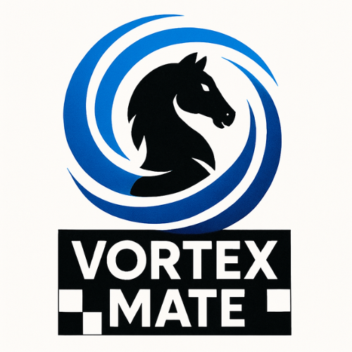

<!-- VortexMate Chess README.md - Release v1.0.0 -->

<p align="center">
  
</p>

# VortexMate Chess

[](https://github.com/yourorg/VortexMate/actions)
[](LICENSE)

**VortexMate** is a modern, cross-platform, open source 3D chess game featuring advanced AI, local and online multiplayer, full game replay, and a stylish Raylib-powered user interface.

---

## 🌟 Overview

- **VortexMate** brings classic chess to life with 3D graphics, smooth overlays, and support for single player (AI), local hotseat, and online play.
- Built on [Raylib](https://www.raylib.com/) for performance and portability.
- Powered by a robust C99 codebase and a clean, modular architecture.
- Free and open source under the MIT License.

---

## 🚀 Features

- **Cross-Platform:** Windows, Linux, macOS (CMake + Raylib)
- **Game Modes:** 
  - Single Player (vs AI, 3 difficulties)
  - Local Hotseat (2 players, one computer)
  - Online Multiplayer (TCP, host/join)
- **Smart AI:** 
  - Easy: random moves
  - Medium: minimax (2–3 ply)
  - Hard: deep minimax (4–5 ply, alpha-beta)
- **Save & Replay:** 
  - Local/AI games saved to SQLite DB with full PGN move history, date, and result
  - Replay mode: step through any saved game with ← → arrows
- **Modern UI:**
  - Fade-in/fade-out logo (with fallback if missing)
  - Responsive overlays: turn, move, game status, AI eval, multiplayer connection
  - Stylish menus, pause, and game over screens
  - Configurable window size/fullscreen, AI difficulty, and volume (config.json)
- **Game Logic:**
  - Full chess rules (castling, en passant, promotion, draw detection)
  - Draw by repetition and 50-move rule
  - Resign function
- **Branding:** 
  - Watermark, version string, and clean font/colors throughout

---

## 🏗️ Build Instructions

### Prerequisites

- [Raylib](https://www.raylib.com/) (v4.0+)
- [SQLite3](https://sqlite.org/)
- [CMake](https://cmake.org/) (v3.10+)
- C99-compatible compiler (gcc/clang/MinGW/MSVC)

### Linux/macOS

```sh
# Install dependencies (example: Ubuntu)
sudo apt install libraylib-dev libsqlite3-dev cmake build-essential

# Clone and build
git clone https://github.com/yourorg/VortexMate.git
cd VortexMate
mkdir build && cd build
cmake ..
make

# Run
./VortexMate
```

### Windows (MinGW)

1. Install [Raylib](https://github.com/raysan5/raylib/wiki/Working-on-Windows) and [SQLite3](https://sqlite.org/download.html).
2. Install [CMake](https://cmake.org/download/).
3. Open a terminal:
    ```sh
    git clone https://github.com/yourorg/VortexMate.git
    cd VortexMate
    mkdir build && cd build
    cmake .. -G "MinGW Makefiles"
    mingw32-make
    .\VortexMate.exe
    ```

### macOS

```sh
brew install raylib sqlite3 cmake
git clone https://github.com/yourorg/VortexMate.git
cd VortexMate
mkdir build && cd build
cmake ..
make
./VortexMate
```

---

## 🎮 Controls & Menus

- **Main Menu:**  
    - New Game (AI / Local / Multiplayer / Load / Replay)
    - AI Difficulty: Easy, Medium, Hard
    - Saved Games: Browse & Replay
    - Quit

- **In Game:**  
    - Click to select/move pieces
    - **Esc:** Pause menu (Resume, Save [if allowed], Resign, Quit)
    - **Resign:** Ends game immediately (records result)
    - **Replay Mode:**  
        - ← / → : Step backward/forward through moves
        - **Esc/Back:** Return to menu

- **Multiplayer:**  
    - Host: Wait for opponent (shows status)
    - Join: Enter IP/port to connect
    - Play alternates automatically; connection loss returns to menu

- **Game Over:**  
    - Result overlay (Win/Loss/Draw/Resign)
    - All resources auto-cleanup, DB/game logs only for local/AI

---

## 📸 Screenshots

<p align="center">


</p>

*Replace with your own screenshots or animated GIFs!*

---

## ⚙️ Configuration

- **config.json** (created on first run):
    - Window width/height, fullscreen
    - AI default difficulty
    - Volume (future sound support)

You can edit this file or use the in-game settings menu (planned for v1.1+).

---

## 💾 Files & Folders

```
VortexMate/
├── assets/           # VortexMate.png, screenshots, etc.
├── saves/            # Game history DB, save slots
├── src/              # Source code (.c)
├── include/          # Headers (.h)
├── CMakeLists.txt
├── config.json
├── README.md
├── LICENSE
```

---

## 🛤️ Roadmap

- [ ] Sound effects and theme music
- [ ] PGN/FEN export/import
- [ ] Piece-square AI evaluation
- [ ] Network NAT traversal / UPnP
- [ ] Steam & Flatpak builds
- [ ] Touch/mouse mobile port
- [ ] In-game settings menu

---

## 🙏 Credits

- Built with [Raylib](https://www.raylib.com/) and [SQLite3](https://sqlite.org/)
- Chess logic and AI: VortexMate Team
- Logo and UI: Mukarram T Bambot

---

## 👨‍💻 Developer Section

**Mukarram T Bambot**

📧 Email: [mukbambot118@gmail.com](mailto:mukbambot118@gmail.com)  
[GitHub](https://github.com/MukarramBambot) • [LinkedIn](https://www.linkedin.com/in/mukarrambambot) • [Portfolio](https://mukarrambambotporfolio.netlify.app/)

Found a bug? Open an [issue](https://github.com/MukarramBambot/VortexMate/issues). Pull requests are welcome!

---

<p align="center"><b>VortexMate v1.0.0 &copy; 2025 VortexGame</b></p>
